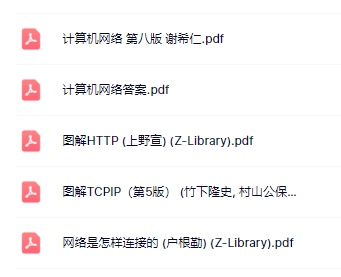

计算机网络

上课学期：2026春季学期

老师：洪峰

评价:老师很nice，很有实力（教授职称，专门研究物联网的，所以老师特别懂计算机网络，好好听课可以学到很多东西，老师是上海交通大学的，上课也会讲一些上交的趣事，只可惜我不经常去上课，缺勤也被记了一次。老师如果有开课可以去选洪峰老师的课，每个老师给分都差不多的。我这届的助教也很nice的。hjr和wt学长。

重点主要是以总结老师讲的知识点为主 题目没啥题目

一些计网有关的课本教材资料分享：

通过百度网盘分享的文件：
链接: https://pan.baidu.com/s/1mGcCulh5k9bEz982pRkSig?pwd=0303 提取码: 0303 

